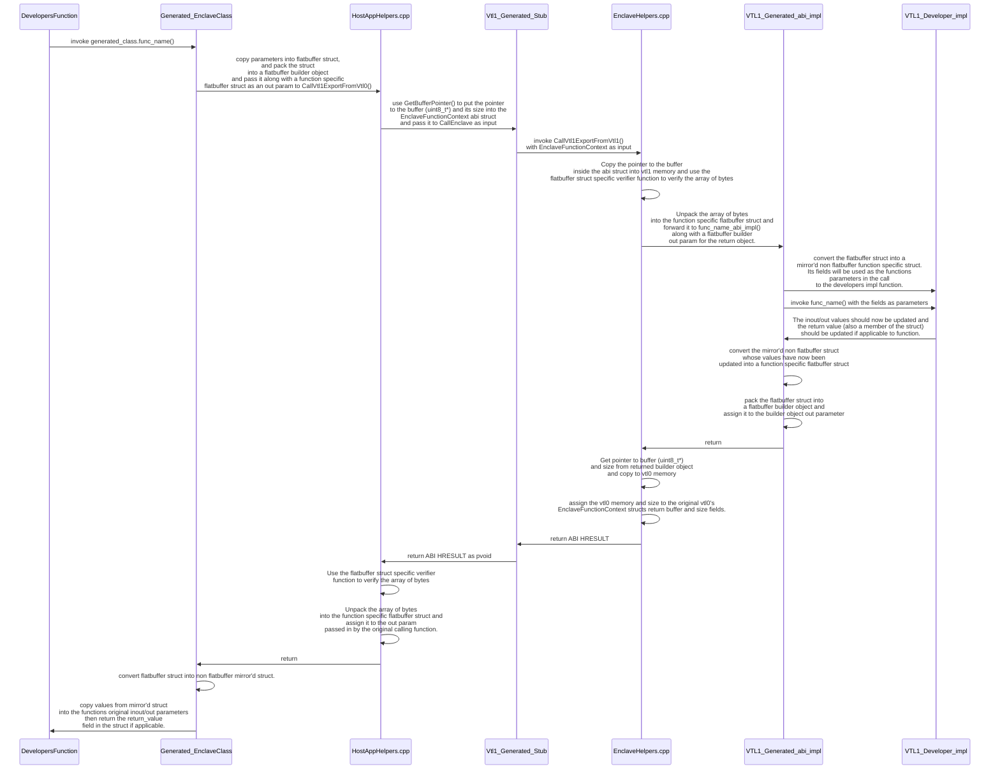
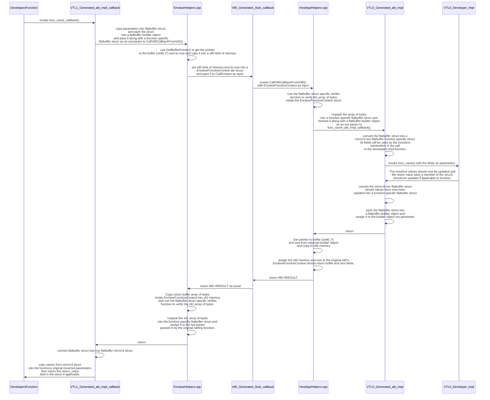

## VbsEnclaveTooling Code Geneneration

The basic premise of our code generation is to allow developers to call their functions that live in either VTL1 or
VTL0 in a natural way without having interact with the `CallEnclave` api and `void*` mechanics. The generated code
will package up your function parameters, copy them into and out of either VTL0 and VTL1, then forward them to their
the your implementation function. The developer can then focus on their on their business logic instead of the logic 
around the trust boundary. The invariant we will maintain is that parameters passed to a developers VTL0 function 
should contain only VTL0 memory, and parameters passed into a developers VTL1 function should only contain VTL1 memory.
To accomplish this our ABI layer will act in the middle between cross trust boundary calls, copying parameters into
VTL0/VTL1, passing only the copy with the correct memory type to the developers function.

### Here is how it works

1. Developer creates an .edl file like [example edl](../tests/EnclaveTests/CodeGenTestFunctions.edl).
   For some background on our edl support see: [more on edl here](./Edl.md).
1. Developer Adds nuget package to both their enclave visual studio project and their hostapp visual studio project. 
   Following the `Using VbsEnclaveTooling.exe from within your own Visual Studio project to generate code` section
   in the root README.md file in the repository
1. When the developer builds their project and uses the `Enclave` string in the `<VbsEnclaveVirtualTrustLayer />`
   attribute in their `vcxproj/.props/.targets` file the following artifacts will be generated in the directory they 
   chose as their output directory:
   ```
    VbsEnclave/
    |
    |--- Enclave/
    |       |--- vbsenclave.def
    |       |--- Implementations.h
    |       |--- Stubs.cpp
    |       |--- DeveloperTypes.h
   ```
1. When the developer builds their project and uses the `HostApp` string in the `<VbsEnclaveVirtualTrustLayer />`
   attribute in their `vcxproj/.props/.targets` file the following artifacts will be generated in the directory they 
   chose as their output directory:
   ```
    VbsEnclave/
    |
    |--- HostApp/
            |--- Stubs.h
            |--- DeveloperTypes.h

   ```

   `Note 1:` The default output directory when using the nuget package is `$(ProjectDir)\Generated Files`
   `Note 2:` During build time the files will automatically be added to the projects build so there is no need to
             explicitly include them.

### Files Generated
#### Generated for both Enclave and HostApp projects

- `DeveloperTypes.h`  - This contains all the types the developer provided within the .edl file.

#### Generated only for Enclave project

- `vbsenclave.def`    - A module definition file that contains all generated stub functions the vbs enclave abi uses
                        to call the developers impl function in vtl1
- `Implementations.h` - This contains all of the generated developer VTL1 impl function declarations that the
                        developer outlined in the `Trusted` section of the edl file. The developer must implement 
                        these. It also contains the ABI impl functions used to call into the developers impl function
                        from the ABI. If a developer adds functions to the `Untrusted` section of the edl file, then 
                        a subsequent static function with the word `callback` appended to the name will be added to
                        the file. A developer can use these generated functions to call into a callback function they
                        implement in vtl0 (hostApp).
- `Stubs.cpp`         - This contains all of the generated VTL1 stub functions that will be exported by the enclave.
                        The ABI will call into these functions from the hostApp inorder to eventually call into the 
                        developers impl function in the enclave (vtl1). 

#### Generated only for HostApp project

- `Stubs.h`           - This contains a class that takes a `void*` to an enclave instance at construction time. If the
                        developer adds function declarations to the `Trusted` section of the .edl file, then the class
                        will contain abi stub functions that the developer will use in the hostApp to call their impl 
                        function in vtl1. The class also includes static function declarations that the developer must 
                        implement if they add function declarations to the `Untrusted` section in the .edl file.

`Note 3:` The class is tied to the enclave dll in the sense that the stubs within it use the `void*` and the name of 
the stub function in vtl1 to call into the abi layer. If the void* was null or a different enclave the call would fail.
Unless of course that enclave exports a function with the same name and parameters. It is up to the developer to 
provide the correct enclave instance to the class.

### ABI layer

The tooling nuget package exports 6 header files that the above files rely on to call an enclave function from the 
hostApp or vice versa:

#### Shared by both Enclave and HostApp

1. `VbsEnclaveAbiBase.h` - Contains the base structures and parameter forwarding functions needed by both sides 
                           (hostApp and enclave) so the correct parameters and correct vtl1/vtl0 impl functions 
                           are called. This closes the gap between the ABI and the developers impl functions in 
                           vtl1 and vtl0.

#### Available only to Enclave when macro is set

1. `EnclaveHelpers.h`    -  Contains function that the generated abi functions will use when making calls into the enclave
                           (HostApp -> Enclave) and out of the enclave (Enclave -> HostApp). The functions in this 
                            file use the Win32 enclave accessor functions `EnclaveCopyOutOfEnclave` and 
                           `EnclaveCopyIntoEnclave`to copy data into and out of the enclave. 
                            Note: `CallVtl0CallbackFromVtl1` uses the `CallEnclave` Win32 api to call into a generated vtl0 callback
                            function which then forwards the function parameters to the developers vtl0 callback impl function.
                            See the `Enclave -> HostApp scenario` and `Call flow Enclave -> HostApp` below for more details.
1. `Vtl0Pointers.h`      - Contains smart pointers that the abi used when dealing vtl0 memory.
1. `MemoryAllocation.h`  - Contains code necessary to allocate vtl0 memory from vtl1.
1. `MemoryChecks.h.h`    - Contains code necessary to check and verify vtl0 and vtl1 memory bounds.

`Note 4:` an enclave project must include a preprocessor macro called `__ENCLAVE_PROJECT__` for the content of these files to be
          available to the project.

#### Available only to HostApp

1. `HostHelpers` - Similiar to `EnclaveHelpers.h` but for the vtl0 side. It contains functions to forward parameters from 
                   from the abi layer in vtl1 to a vtl0 function and return that functions return value back to vtl1.
                   It also handles the opposite case where a function in vtl1 is called from vtl0. In this case there is a
                   generated vtl0 function which is associated with the developers implementation of a `trusted` vtl1 
                   function.
                   Note: `CallVtl1ExportFromVtl0` uses the `CallEnclave` Win32 api to call into a generated vtl1 export
                   function which then forwards the function parameters to the developers vtl1 impl function.
                   See the `HostApp -> Enclave scenario` and `Call flow HostApp -> Enclave` below for more details.

#### How to access files

You typically won't ever need to interact with these files explicitly.
These can be accessed via:
```
#include <VbsEnclaveABI\Shared\VbsEnclaveAbiBase.h>
#include <VbsEnclaveABI\Enclave\EnclaveHelpers.h>
#include <VbsEnclaveABI\Shared\MemoryAllocation.h>
#include <VbsEnclaveABI\Shared\MemoryChecks.h>
#include <VbsEnclaveABI\Host\HostHelpers.h>
```
### Generated code usage

for the following example we will assume the developer used the following .edl file content and the `VbsEnclaveTooling.exe`
executable generated code based on it.

```
// example edl
enclave {
    struct ExampleStruct
    {
        vector<string> vec_str;
        wstring arr_str[5];
        int32_t* int_ptr;
    };

    trusted {
        string TrustedExample(
            [out] vector<int8_t> int8_vec,
            int64_t* some_ptr, // no attribute so by default will be _In_ attribute.
            [int, out] ExampleStruct ex_struct
        );
    };

    untrusted {
        HRESULT UntrustedExample(
            [in, out] string some_string,
            [out] wstring some_wstring
        );
    };
};
```

Imagine the developer passes the string `MyEnclave` as the `Vtl0ClassName` argument and `VbsEnclave` as the 
`Namespace` argument to `VbsEnclaveTooling.exe` executable. The following sections describe what will be 
generated and how the developer will interact with the generated code.

#### HostApp -> Enclave scenario (trusted scope)

A class will be generated that will take in the enclaves `void*` in its constructor. This class contains
VTL0 versions for every function the developer declares in the `trusted` scope of the .edl file. See the
`Data flow HostApp -> Enclave` for the sequence of class that will happen when the developer invokes a
class method. This call is generated in the `Stubs.h` file in the `HostApp project`

The expectation is for a developer to use the generated class in the following way:
```C++
// This is in vtl0, in a developer function where they want to call their enclave trusted function.
// omitted Win32 code to create/initialize and load the enclave's void*, but imagine we have a void* variable we 
// called enclave_void_star after we created it.
MyEnclave generated_class = VbsEnclave::MyEnclave(enclave_void_star);
THROW_IF_FAILED(generated_class.RegisterVtl0Callbacks()); // call RegisterVtl0Callbacks at least once.
std::vector<int8_t> int8_vec {};
int64_t some_int64 = 0;
ExampleStruct ex_struct{};
ex_struct.vec_str.push_back("string 1");
ex_struct.arr_str[0] = L"wstring 1";
int32_t int32_val = 67678;
ex_struct.int_ptr = &int32_val;

auto enclave_str = generated_class.TrustedExample(int8_vec, &some_int64, ex_struct);
for(size_t i; i < int8_vec.size(); i++)
{
    // The abi layer should have done the work to copy the vtl1 data into our vtl0 vector
    // Should print 0, 1, 2, 3, 4 ... up to 9
    std::cout <<  int8_vec[i] << std::endl;
}

for(auto& value : ex_struct.vec_str)
{
    // The abi layer should have done the work to copy the vtl1 data into our vtl0 vector
    // Should print "string 1", "string 2" , "string 3" etc
    std::cout <<  value << std::endl;
}

for(auto& value : ex_struct.arr_str)
{
    // The abi layer should have done the work to copy the vtl1 data into our vtl0 array
    // Should print "wstring 1", "wstring 2" , "string 3" etc
    std::wcout <<  value << std::endl;
}

std::cout <<  *ex_struct.int_ptr << std::endl; // should be 20
std::cout <<  enclave_str << std::endl; // should be "String from enclave!"

```

`Note: 5` Regardless of whether or not a developer add functions to the 'trusted' or the 'untrusted' scopes in the .edl
file there will be a `RegisterVtl0Callbacks` function that is generated. This function will register the 
`AllocateVtl0MemoryCallback` and `DeallocateVtl0MemoryCallback` function to the vtl1 callback tabled. This
is needed for the ABI layer to function properly. So the `RegisterVtl0Callbacks` function must be called at
least once for the lifetime of then enclave before attempting to use the methods in the generated enclave class.

Back in the enclave a declaration for the enclave function would have been generated in the `Implementations.h` file.
The developer is expected to create a defintion for this declaration. Using the example .edl above the following 
declaration would be generated.

```C++
namespace VbsEnclave
{
    namespace VTL1_Declarations
    {
        std::string TrustedExample(
            _Out_ std::vector<int8_t>& int8_vec, 
            _In_ const std::int64_t* some_ptr,
            _Out_ ExampleStruct& ex_struct );
    }
}
```

`Note: 6` When the `out` annotation is used in tandom with a pointer, the code generator will generate both the
abi and the developer impl functions using a shared_ptr reference for that parameter. On function invocation, 
_Out_ shared ptrs are null. The developer is expected to reseat the ptr by assigning the parameter value with a 
call to std::make_shared, should they want to provide it with a value before the function returns.

`Note: 7` Edl support both the `string` and `wstring` key words.

Continuing on, the developer could implement the declaration as follows:
```C++
std::string VTL1_Declarations::TrustedExample(
    _Out_ std::vector<int8_t>& int8_vec, 
    _In_ const std::int64_t* some_ptr,
    _Out_ ExampleStruct& ex_struct)
{
    std::vector<std::int8_t> int8_vector(10);
    std::iota(int8_vector.begin(), int8_vector.end(), 0);
    *ex_struct.int_ptr = 20;
    
    for (int i = 2; i < 6; i++)
    {
        ex_struct.vec_str.push_back("string "+ std::to_string(i));
    }

    for (int i = 2; i < ex_struct.arr_str.size(); i++)
    {
        ex_struct.arr_str.push_back(L"wstring "+ std::to_wstring(i));
    }

    *ex_struct.int_ptr = 20;

    // Note needed but just for illustration that the pointer value was copied. 
    if (*some_ptr != 67678)
    {
        throw std::runtime_error("expected some_ptr == 67678");
    }

    return "String from enclave!";
}
```

`Note: 8` As you can see in the code the developer writes, they never interact with the CallEnclave api, 
create a module.def file or even call into an exported function directly. This is all done by the abi layer. The  code
generator underhood generates export functions based on the declarations in the `trusted` scope and exports these
generated functions within the generated module.def file.

#### Call flow HostApp -> Enclave diagram (view in Github's preview mode)


#### Enclave -> HostApp scenario (untrusted scope)

In the untrusted scenario, the function that the developer will implement is what we call a `callback`. Although
technically the callback is really a generated function that contains a single `void*` as input and `void*` as output.
These can be found in the generated `Stubs.cpp` file in the enclave. The developer never interacts with these directly and they
are used by the abi layer to forward and return parameters to the correct developer impl function for the callback.
Instead, the developer interacts with a generated static function in the `Implementations.h` file in the enclave that
will use the abi function `CallVtl0CallbackFromVtl1` to call into the callback. 

This is how the developer will interact with it:

```C++
// This is in vtl1, in a developer function where they want to call their vtl0 untrusted function.
// In this case we want to pass a string and a wstring to vtl0 and have it return an HRESULT.
std::string str1 = "The quick brown";
std::wstring wstr1{};
HRESULT result = VbsEnclave::VTL0_Callbacks::UntrustedExample_callback(str1, wstr1);

// Not needed but explicitly showing the values we expect our str1 and str2 to contain after
// calling the callback.
RETURN_IF_FAILED(result);
RETURN_HR_IF(INVALIDARG, str1 != "The quick brown fox jumps over the lazy dog");
RETURN_HR_IF(INVALIDARG, str2 != "HELLO WORLD FROM VTL0");

```

`Note: 9` As you can see, for inout parameters the caller must allocate memory first before passing the pointer
to the abi generated function. The returned data will be memcpy'd into this pointer by the abi before control
is given back to the caller function.

`Note: 10` We explicitly add the suffix `_callback` to the end of the function name so as to avoid name conflicts
with the host to enclave functions in the generated class in vtl0.

In vtl0 there would have been a generated static class method declaration for the untrusted function in the `Stubs.h`
file. This would look like the following:

```C++
namespace VbsEnclave
{
    namespace VTL0_Stubs
    {
        struct MyEnclave
        {

        public:

            static HRESULT UntrustedExample_callback(
                _Inout_ std::string& some_string,
                _Out_ std::wstring& some_wstring);
        };
    }
}
```

The developer must implement the declaration. One way would be as follows:

```C++
HRESULT MyEnclave::UntrustedExample_callback(
        _Inout_ std::string& some_string,
        _Out_ std::wstring& some_wstring)
{
    // Not needed but explicitly showing the values we expect some_string 
    // and some_wstring to contain from vtl1.
    RETURN_HR_IF(INVALIDARG, some_string != "The quick brown");
    RETURN_HR_IF(INVALIDARG, some_wstring != L"");
    
    some_string += " fox jumps over the lazy dog";
    some_wstring = L"HELLO WORLD FROM VTL0";

    return S_OK;
}
```

`Note: 11` As you can see, again the developer no longer has to worry about copying parameters into
and out of the enclave or using the `CallEnclave` Win32 api directly.

### Data flow Enclave -> HostApp diagram (view in Github's preview mode)


