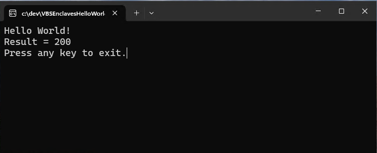

# Hello World VBS Enclave SDK Walkthrough

## Prerequisites
 
`Windows SDK 10.0.26100.3916 or higher`
  
The Windows SDK can be installed in one of the following ways:
1. via installing the `Windows 11 SDK (10.0.26100.0)` individual component in the `Visual Studio v17.14` installer
1. via using the `Windows 11 SDK (10.0.26100.0)` installer through the [Windows SDK installer website](https://developer.microsoft.com/windows/downloads/windows-sdk/)
1. via adding the [Microsoft.Windows.SDK.CPP](https://www.nuget.org/packages/Microsoft.Windows.SDK.CPP/) packages to your Visual Studio project via Nuget.

 
### Prepare your dev environment
Full instructions can be found at [VBS Enclaves dev guide](https://learn.microsoft.com/en-us/windows/win32/trusted-execution/vbs-enclaves-dev-guide)

> [!Important] 
> The following steps turn off security features in Windows and allows unsigned drivers to load. Consider only doing so when needed for testing, or setup a test vm. 
> * The device must have a TPM that is enabled in the BIOS.
> * Ensure you are running on a device with Windows 11, version 10.0.26100.3916 or higher
> * Turn off [Secure Boot](https://learn.microsoft.com/en-us/windows-hardware/manufacture/desktop/disabling-secure-boot?view=windows-11)
> * If Bitlocker is enabled, you will need access to your recovery keys
> * Enable [Test Signing](https://learn.microsoft.com/en-us/windows-hardware/drivers/install/the-testsigning-boot-configuration-option). From an elevated command prompt, run the following and reboot: 
>   *  ```BCDEdit /set TESTSIGNING ON```
> * Enable [Memory Integrity](https://learn.microsoft.com/en-us/windows/security/hardware-security/enable-virtualization-based-protection-of-code-integrity?tabs=security). In the Windows Security app, go to Device Security -&gt; Core Integrity -&gt; and toggle Memory Integrity ON, then Reboot.
> * Create a test certificate to use for signing the VBS Enclave. Replace "TheDefaultTestEnclaveCertName" with the name you wish to create. eg: <br />
> ```powershell <br />
>   -SelfSignedCertificate -CertStoreLocation Cert:\\CurrentUser\\My -DnsName "TheDefaultTestEnclaveCertName" -KeyUsage DigitalSignature -KeySpec Signature -KeyLength 2048 -KeyAlgorithm RSA -HashAlgorithm SHA256 -TextExtension "2.5.29.37={text}1.3.6.1.5.5.7.3.3,1.3.6.1.4.1.311.76.57.1.15,1.3.6.1.4.1.311.97.814040577.346743379.4783502.105532346 ```

## Solution structure
This sample will create a Host app, a DLL project and include a solution level file as follows:
- MyHostApp solution
  - MySecretEnclave.edl
  - MyHostApp project
    - main.cpp
  - MySecretEnclave project
    - MySecretEnclaveExports.cpp

## Build the sample
### Create the initial host app project and solution
Start Visual Studio and create new C++ Console App named **MyHostApp**.

### Add the Enclave Definition Language file to the solution
* Right click the solution inside Visual Studio
* Select `New item` from the dropdown.
* Select the `Text` file option and name it **MySecretEnclave.edl**.
* Inside **MySecretEnclave.edl** define a simple method for the enclave in the trusted scope:
```C++
enclave
{
    trusted
    {
        uint32_t DoSecretMath(
            uint32_t val1,
            uint32_t val2
        );
    };
};
```
### Add the Enclave DLL project to the solution
* Add a new dll project to the solution and name it **MySecretVBSEnclave**. This will be the enclave dll.
   * Right click the project and select the `Manage Nuget Packages` option.
   * When the window pops up add the latest [Microsoft.Windows.VbsEnclave.SDK](https://www.nuget.org/packages/Microsoft.Windows.VBSEnclave.SDK) and [Microsoft.Windows.VbsEnclave.CodeGenerator](https://www.nuget.org/packages/Microsoft.Windows.VbsEnclave.CodeGenerator) nuget packages.
* Update `dllmain.cpp` with the enclave configuration information as follows. For more information on these values and how they impact the enclave sealing policy, please refer to the [enclave sealing identity policy](https://learn.microsoft.com/en-us/windows/win32/api/ntenclv/ne-ntenclv-enclave_sealing_identity_policy) documentation.
    ```C++
    #include "pch.h"
    #include <array>

    // Family ID will be assigned via Azure Trusted Signing
    // For private testing you can use any 16 byte value except 1 or 0
    #define SAMPLE_ENCLAVE_FAMILY_ID \
        { \
            0xED, 0X1D, 0xD0, 0x21, 0xC1, 0xB3, 0x42, 0x4C, \
            0x96, 0x49, 0xF6, 0xE9, 0x18, 0x18, 0x70, 0x36, \
        }
    
    #define SAMPLE_ENCLAVE_IMAGE_ID \
        { \
            0x9B, 0x9B, 0x50, 0xDD, 0x83, 0x2F, 0x44, 0xFD, \
            0xB3, 0x8D, 0xAD, 0x87, 0x92, 0xD6, 0x9F, 0x42, \
        }
    
    // Example version - 10.0.26100.0 -> A.0.65F4.00
    #define SAMPLE_ENCLAVE_IMAGE_VERSION 0xA065F400 

    // Security version number
    #define SAMPLE_ENCLAVE_SVN 1000
    
    #define SAMPLE_ENCLAVE_ADDRESS_SPACE_SIZE \
        0x20000000          // The expected virtual size of the private address range 
                            // for the enclave, in bytes, in 2MB increments. (512MB)
                            // The host call to ::create(,,,<size>) must be the same value
    
    // Enclave image creation policies
    #ifndef SAMPLE_ENCLAVE_MAX_THREADS
    #define SAMPLE_ENCLAVE_MAX_THREADS 16
    #endif
    
    // Ensure we only enable debugging in DEBUG builds
    constexpr int EnclavePolicy_EnableDebuggingForDebugBuildsOnly
    {
    #ifdef _DEBUG
        IMAGE_ENCLAVE_POLICY_DEBUGGABLE
    #endif
    };
    
    // VBS enclave configuration - included statically
    extern "C" const IMAGE_ENCLAVE_CONFIG __enclave_config = {
        sizeof(IMAGE_ENCLAVE_CONFIG),
        IMAGE_ENCLAVE_MINIMUM_CONFIG_SIZE,
        EnclavePolicy_EnableDebuggingForDebugBuildsOnly,
        0,
        0,
        0,
        SAMPLE_ENCLAVE_FAMILY_ID,
        SAMPLE_ENCLAVE_IMAGE_ID,
        SAMPLE_ENCLAVE_IMAGE_VERSION,
        SAMPLE_ENCLAVE_SVN,
        SAMPLE_ENCLAVE_ADDRESS_SPACE_SIZE,
        SAMPLE_ENCLAVE_MAX_THREADS,
        IMAGE_ENCLAVE_FLAG_PRIMARY_IMAGE};
    
    BOOL WINAPI DllMain(HINSTANCE, DWORD reason, LPVOID)
    {
        switch (reason)
        {
            case DLL_PROCESS_ATTACH:
                break;
            case DLL_PROCESS_DETACH:
                break;
            case DLL_THREAD_ATTACH:
                break;
            default:
                break;
        }
        return TRUE;
    }
    ```
* Unload the project and add new properties for the libraries and EDL code generator. These are typically placed after the default `User Macros` properties. 
```xml
<!-- ********* -->
<!-- Paths to enclave libraries -->
<!-- ********* -->
<PropertyGroup Label="EnclaveLibs">
  <VC_LibraryPath_Enclave Condition="'$(Platform)'=='x64'">$(VC_LibraryPath_VC_x64_Desktop)\enclave</VC_LibraryPath_Enclave>
  <VC_LibraryPath_Enclave Condition="'$(Platform)'=='ARM64'">$(VC_LibraryPath_VC_arm64_Desktop)\enclave</VC_LibraryPath_Enclave>
    <WindowsSDK_LibraryPath_Enclave>
    $(WindowsSDK_LibraryPath)\..\ucrt_enclave\$(Platform)
  </WindowsSDK_LibraryPath_Enclave>
  <VBS_Enclave_Dependencies>
    vertdll.lib;
    bcrypt.lib;
    $(VC_LibraryPath_Enclave)\libcmt.lib;
    $(VC_LibraryPath_Enclave)\libvcruntime.lib;
    $(WindowsSDK_LibraryPath_Enclave)\ucrt.lib;
  </VBS_Enclave_Dependencies>
</PropertyGroup>

<!-- ********* -->
<!-- EDL Code Generator properties -->
<!-- ********* -->
<PropertyGroup Label="EDL Codegen props">
  <VbsEnclaveEdlPath>$(ProjectDir)..\MySecretEnclave.edl</VbsEnclaveEdlPath>
  <VbsEnclaveNamespace>VbsEnclave</VbsEnclaveNamespace>
  <VbsEnclaveVirtualTrustLayer>Enclave</VbsEnclaveVirtualTrustLayer>
</PropertyGroup>
    
<!-- ********* -->
<!-- Property Group for Cert to sign with -->
<!-- ********* -->
<PropertyGroup Label="Test Signing certificate">
    <EnclaveCertName>TheDefaultTestEnclaveCertName</EnclaveCertName>
</PropertyGroup>

<!-- ********* -->
<!-- Properties for Post-Build Commands -->
<!-- ********* -->
<PropertyGroup Label="Post-Build command props">
    <VEIID_Command>"$(WindowsSDKVersionedBinRoot)\$(PlatformTarget)\veiid.exe" "$(OutDir)$(TargetName)$(TargetExt)"</VEIID_Command> 
    <SIGNTOOL_Command>signtool sign /ph /fd SHA256 /n "$(EnclaveCertName)" "$(OutDir)$(TargetName)$(TargetExt)"</SIGNTOOL_Command>
</PropertyGroup>
```

> [!Note]
>  * Adding the enclave libraries using the `<VBS_Enclave_Dependencies />` property is not needed when using the `Microsoft.Windows.VbsEnclave.CodeGenerator` and the `Microsoft.Windows.SDK.CPP` nuget packages together. The `CodeGenerator` contains this property already and will inject it into your build.
>  * Remember to update the name of the test certificate created earlier.

* Save and Reload the project.
* Right click the project and open the properties window.
* Set your configuration to `All configurations` and your platform to `All Platforms` and then set the following properties.
    * `C/C++ compilation` settings:
       * `Basic runtime checks` –> **Default**
       * `C++ Language Standard` -> **/std:c++ 20** (due to usage of span)
       * `Conformance mode` -> **Yes (permissive-)**
       * `Runtime Library` – MultiThreaded Debug **/MTd** for debug builds, and **/MT** for Release builds
    
    * `Linker` settings:
        * `Enable Incremental Linking` -> **No (/INCREMENTAL:NO)**
        * `Ignore All Default Libraries` -> **Yes (/NODEFAULTLIB)**
        * `Add Additional Dependencies` -> **$(VBS_Enclave_Dependencies)**
        * `Command line` -> `additional options` -> **/ENCLAVE /INTEGRITYCHECK /GUARD:MIXED**
          
    * `Post-Build Event` under `Build Events`:
        * `Command Line` -> **`$(VEIID_Command)$(SIGNTOOL_Command)`**
        * `Description` -> **Apply VEIID Protection and sign the enclave**
        * `Use In Build` -> **Yes**

* Open `pch.h` and add the `wil_for_enclaves.h` header as the first `#include` eg:
```C++
#ifndef PCH_H
#define PCH_H

// Include the wil_for_enclave header file. This is needed so you can use the 
// Windows Implementation Library and other Windows #defines that appear in dllmain.cpp
// You can also access Windows Macros via the windows.h header.
#include <wil\enclave\wil_for_enclaves.h>

#endif //PCH_H
```
> [!Important]
> To use the [Windows Implementation Library](https://github.com/microsoft/wil) inside your enclaves .cpp files you must include the `wil_for_enclaves` header as the **first** `#include` in your precompiled header or the .cpp files themselves.

* Right click the dll project and choose `Build`. This will generate the projection layer for the enclave dll. You should have a couple initial error messages after code generation due to lack of implementation. We will fix this in the next step.

> [!Note]
>  To view the generated files, choose `Show All Files` in solution explorer and navigate to `Generated Files\VbsEnclave\Enclave`. Functions in the trusted scope of the .edl file will have a function declaration generated in `Generated Files\VbsEnclave\Enclave\Implementations.h`. For more information on code generation, view [CodeGeneration.md](./CodeGeneration.md).

* Add a cpp file to the dll project and name it `MySecretEnclaveExports.cpp`. This is where we will define the `DoSecretMath` function that we declared in the `MySecretEnclave.edl` file. You need to include the `Implementations.h` file, and then define the function:
```cpp
#include "pch.h"
#include <VbsEnclave\Enclave\Implementations.h>

uint32_t VbsEnclave::VTL1_Declarations::DoSecretMath(_In_  std::uint32_t val1, _In_  std::uint32_t val2)
{
    return val1 * val2;
}
```
1.	`Build` the project again. **There should be no errors this time**.

### Build the host app
* Right click the `MyHostApp` project and select the `Manage Nuget Packages` option.
   * When the window pops up add the latest [Microsoft.Windows.VbsEnclave.SDK](https://www.nuget.org/packages/Microsoft.Windows.VBSEnclave.SDK) and [Microsoft.Windows.VbsEnclave.CodeGenerator](https://www.nuget.org/packages/Microsoft.Windows.VbsEnclave.CodeGenerator) nuget packages.
* Unload the project and add the following properties. 
```xml
<!-- ************ -->
<!-- VBS Enclave codegen properties for host -->
<!-- ************ -->
<PropertyGroup>
   <VbsEnclaveEdlPath>$(ProjectDir)..\MySecretEnclave.edl</VbsEnclaveEdlPath>
   <VbsEnclaveVtl0ClassName>MySecretEnclave</VbsEnclaveVtl0ClassName>
   <VbsEnclaveNamespace>VbsEnclave</VbsEnclaveNamespace>
   <VbsEnclaveVirtualTrustLayer>HostApp</VbsEnclaveVirtualTrustLayer>
</PropertyGroup>
```
> [!TIP]
> To keep these properties in sync between both the enclave and the hostApp projects, consider moving the first 3 properties into a separate `.props` file and import that into both projects.

> [!Note]
> The `<VbsEnclaveVirtualTrustLayer />` property for the hostApp project is optional. `HostApp` is assumed if the property is missing.

* Reload the project, and then in project properties, set compiler and linker flags as follows:
   * `Compiler` -> `C/C++ Language Standard`, choose **ISO C++20 Standard (/std:c++20)**

* Right-Click on the project and choose `Build`, it should succeed. 

> [!Note]
>  To view generated files in the HostApp select `Show all files` in solution explorer. You should see the `Generated Files\VbsEnclave\HostApp` folder. The file of interest is the `Stubs.h` file. For more information on code generation, view [CodeGeneration.md](./CodeGeneration.md).

* In your `main` method, initialize the enclave and call its methods
    * Add the host side include file from the SDK nuget package and the new Stubs.h code generated header.
        ```c++
        #include <conio.h>
        #include <iostream>
        #include <veil\host\enclave_api.vtl0.h>
        #include <VbsEnclave\HostApp\Stubs.h>
        ```
    * Initialize the enclave and call its interface:
        ```cpp
        // Create app+user enclave identity
        auto ownerId = veil::vtl0::appmodel::owner_id();
    
        // Load enclave
        // We don't want ENCLAVE_VBS_FLAG_DEBUG for a retail build!
        constexpr int EnclaveCreate_Flags {
        #ifdef _DEBUG
            ENCLAVE_VBS_FLAG_DEBUG
        #endif
        };
    
        #ifndef _DEBUG
            static_assert((EnclaveCreate_Flags & ENCLAVE_VBS_FLAG_DEBUG) == 0, "Do not use _DEBUG flag for retail builds");
        #endif
    
        // Memory allocation must match enclave configuration (512MB)
        auto enclave = veil::vtl0::enclave::create(ENCLAVE_TYPE_VBS, ownerId, EnclaveCreate_Flags,
                                                 veil::vtl0::enclave::megabytes(512));
        veil::vtl0::enclave::load_image(enclave.get(), L"MySecretVBSEnclave.dll");
        veil::vtl0::enclave::initialize(enclave.get(), 1);
    
        // Register framework callbacks
        veil::vtl0::enclave_api::register_callbacks(enclave.get());
    
        // Initialize enclave interface
        auto enclaveInterface = VbsEnclave::VTL0_Stubs::MySecretEnclave(enclave.get());
        THROW_IF_FAILED(enclaveInterface.RegisterVtl0Callbacks());
    
        //Call into the enclave
        auto secretResults = enclaveInterface.DoSecretMath(10, 20);
        wprintf(L"Result = %d\n", secretResults);
        wprintf(L"Press any key to exit.");
        _getch();
        ```
    
1. Now right click and choose Build. **It should report success**.
1. Press F5, and now you should be able to debug the sample app and see the result!

> [!Important]
> If you choose to test your enclave inside a VM, you will need to setup Visual Studio Remote Debugging so you can deploy your enclave dll and hostApp executable onto the VM. For information on how to set this up, see [Remote debug a C++ project](https://learn.microsoft.com/en-us/visualstudio/debugger/remote-debugging-cpp?view=vs-2022).
