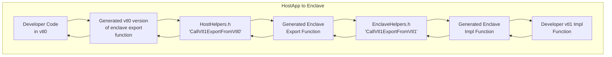
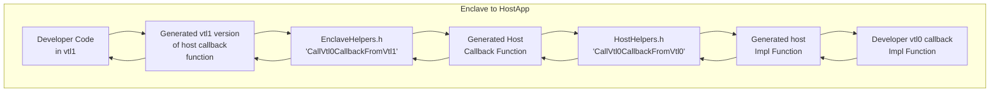

# Parameter passing between virtual trust layers

There are two scenarios our ABI covers `HostApp -> Enclave` and `Enclave -> HostApp`. Regardless of whether the caller
is a function in vtl0 with data destined for a vtl1 function or the caller is a vtl1 function with data destined for 
vtl0, the ABI layer will handle forwarding the parameters from one side to the next. The `VbsEnclaveTooling` 
executable will generate code for communication between both sides of the trust boundary, allowing us to 
forward function parameters and return values between vtl0 and vtl1.
See [CodeGeneration.md](./CodeGeneration.md), for more info on how the code generation works.

Depending on the scenario, the developer will start by calling into a generated function and passing arguments into it:


`Note:` The "Generated Enclave Export Function" is a `VTL1` function that takes a `void*` and returns a `void*` that is 
exported by the enclave. The `CallVtl1ExportFromVtl0` in the above diagram uses the `CallEnclave` Win32 api to call this
function.



`Note:` The "Generated Host Callback Function" is a `VTL0` callback function that takes a `void*` and returns a `void*` 
that the developer must register with a `RegisterVtl0Callbacks` function call. They must do this at least once, before
they can call any HostApp callbacks from the enclave. We will explain how this works in later sections.

`Note:` For both scenarios the ABI will handle returning the result and any out parameters back from the developer impl
function to the developers code that originally initiated the calls.

Continuing on with how parameter passing works, in the initial generated function the abi will package the parameters passed 
to the function into a function specific flatbuffer struct. Each function has a struct generated for it based on its parameters.
Each parameter will have a respective field.

So, if a function looked like this in the .edl file

```C++
int32_t EnclaveAddTwoNums(int32_t num1, int32_t num2);
```
It would have two structs generated:
1. A flatbuffer struct generated by the flatbuffer compiler
1. A non flatbuffer struct that mirrors the above flatbuffer struct but without any of the flatbuffer details.

The non flatbuffer struct would look like this:
```C++
struct EnclaveAddTwoNums_args
{
    std::int32_t m__num1 {};
    std::int32_t m__num2 {};

    // rest of body omitted for clarity
};
```

Having a separate non flatbuffer struct allows us to support things like pointers without needing to update how flatbuffer
structs work. The non flatbuffer struct contains methods to convert the related flatbuffer struct into a normal non flatbuffer
struct and vice versa. We call these non flatbuffer structs dev types, since these are the types the developer will actually
see and interact with.

Note: the developer won't interact with function structs but if they have structs within their .edl file they will interact with 
those structs, which have a similiar setup as the function structs above.

Once the flatbuffer struct has been created the abi function will pack the flatbuffer struct into a flatbuffer builder object. This
builder object now contains a serialized array of bytes that represent the flatbuffer. Next the function passes the builder
object as an in parameter and a return flatbuffer struct as an out parameter into an ABI function in `HostHelpers.h` or `EnclaveHelpers.h`. 

Depending on the scenario, two of four functions are called at some point:

|        File             |        Function           |         Scenario        |       Direction       |
| ----------------------- |:-------------------------:|:-----------------------:|:---------------------:|
| HostHelpers.h           | CallVtl1ExportFromVtl0    |    HostApp -> Enclave   | into enclave          |
| EnclaveHelpers.h        | CallVtl1ExportFromVtl1    |    HostApp -> Enclave   | to enclave functions  |
| EnclaveHelpers.h        | CallVtl0CallbackFromVtl1  |    Enclave -> HostApp   | into hostApp          |
| HostHelpers.h           | CallVtl0CallbackFromVtl0  |    Enclave -> HostApp   | to hostApp functions  |


The `CallVtl1ExportFromVtl0` and `CallVtl0CallbackFromVtl1` functions both serve the same purpose but for their 
respective virtual trust layers. Which is to package up a flatbuffer builder objects' array of bytes into a `EnclaveFunctionContext`
object, call a generated function that takes and returns a `void*`, and finally return the result back to its caller. 
The `EnclaveFunctionContext` is what is used as the `lpParameter` parameter to the `CallEnclave` Win32 api and 
has the following definition:

```C++
struct EnclaveFunctionContext
{
    EnclaveParameters m_forwarded_parameters {};

    EnclaveParameters m_returned_parameters {};
};
```

The `EnclaveParameters` object is defined as:

```C++
struct EnclaveParameters
{
    void* buffer {};
    size_t buffer_size {};
};
```

The array of bytes (uint8_t*) in the builder object is added to the `m_forwarded_parameters` member of the `EnclaveFunctionContext` object.
`m_forwarded_parameters.buffer` will point to the address of the array of bytes and the size of the 
buffer will be used for the `m_forwarded_parameters.buffer_size` member field.

Initially the `m_returned_parameters` buffer member will be null and its buffer_size member will be set to zero. 
The expectation is that the ABI functions in the callee side of the exchange will update these members upon returning
from the developers impl function on the opposing side of the virtual trust layer.

### CallVtl1ExportFromVtl0 and CallVtl0CallbackFromVtl1 similarities

Both `CallVtl1ExportFromVtl0` and `CallVtl0CallbackFromVtl1` take in an `EnclaveFunctionContext`. They expect array of bytes 
inside the `EnclaveFunctionContext.m_forwarded_parameters.buffer` field  and a size inside the 
`EnclaveFunctionContext.m_forwarded_parameters.buffer_size` field. 

The expectation is for this function to unpack the array of bytes into a flatbuffer struct specific to the abi_impl function that
it will call. A flatbuffer builder object is also forwarded to the abi function an an out parameter so the inout/out/return value
from the developer function can be returned back to the original caller across the virtual trust boundary.

### Internal ABI results

We expect all generated functions that are called using `CallEnclave` to return an `HRESULT`. This is just for ABI purposes so we can propagate errors from 
one side to the next. _The developers impl functions themselves can return any of the supported edl types_.

Both of the functions return an HRESULT, so if an ABI function across the virtual trust boundary fails e.g returns a failure HRESULT
or throws the `CallVtl1ExportFromVtl0` and `CallVtl0CallbackFromVtl1` functions would also return that HRESULT back to the caller 
(the generated function that called it). The generated function can then decide to throw an exception or return an HRESULT, based
on how it was generated.

### CallVtl1ExportFromVtl0 and CallVtl0CallbackFromVtl1 differences

CallVtl1ExportFromVtl0 Function signature:

```C++
    template <typename ReturnParamsT>
    static inline HRESULT CallVtl1ExportFromVtl0(
        _In_ void* enclave_instance,
        _In_ std::string_view function_name,
        _In_ flatbuffers::FlatBufferBuilder& flatbuffer_in_params_builder,
        _Inout_ ReturnParamsT& function_result)
```

In the case where `CallVtl1ExportFromVtl0` is used, `enclave_instance` and `function_name` (name of the generated enclave export
function) are used together to get the address of the export function. This is then passed to the `CallEnclave` api as
the `lpRoutine` parameter.

CallVtl0CallbackFromVtl1 Function signature:

```C++
    template <typename ParamsT, typename ReturnParamsT>
    static inline HRESULT CallVtl0CallbackFromVtl1(
        _In_ std::uint32_t function_index,
        _In_ flatbuffers::FlatBufferBuilder& flatbuffer_in_params_builder,
        _Inout_ ReturnParamsT& callback_result)
```

For the `CallVtl0CallbackFromVtl1` case the `index` of the vtl0 callback is what is passed to the function.

### How callbacks work

Based on the function declarations inside the `untrusted` scope of the .edl file, the code generator 
will generate a callback function that can be used in a `CallEnclave` call for each function. In addition to this,
a function called `RegisterVtl0Callbacks` for use in vtl0 and also a `__AbiRegisterVtl0Callbacks__` export
function counterpart in vtl1 are also generated. Calling `RegisterVtl0Callbacks` at least once before interacting with
the other generated callback functions will add each function pointer into a vtl1 map where the index of the function is
the key and the function pointer is the value. This happens because `RegisterVtl0Callbacks` creates a ParameterContainer
using an `std::array` of all the function pointers as input to its constructor. Ultimately a `CallVtl1ExportFromVtl0`
call is made destined for `__AbiRegisterVtl0Callbacks__` export, who will then pass the input to the `RegisterVtl0Callbacks`
ABI function in the EnclaveHelpers.h file where the function pointers are added to the map.

#### Default callbacks that are always added

Regardless of whether or not a developer adds any `untrusted` function declarations to the .edl file two callbacks will be
automatically added:


|        Callback                |        Comments           |   For Developer Use   |   Input parameter  |
| ------------------------------ |:-------------------------:|:---------------------:|:------------------:|
| AllocateVtl0MemoryCallback     | Uses HeapAlloc win32 api  |          No           |   size_t as void*  |
| DeallocateVtl0MemoryCallback   | Uses HeapFree win32 api   |          No           |           -        |


### How copying between virtual trust layers works

As you can see both `CallVtl1ExportFromVtl0` and `CallVtl0CallbackFromVtl1` have sibling functions that
will be called on the other side of the trust boundary. In the HostApp -> Enclave case `CallVtl1ExportFromVtl1` is used to 
copy the vtl0 `EnclaveFunctionContext` and its `forwarded_parameters` member into vtl1. In the Enclave -> HostApp
scenario the `CallVtl0CallbackFromVtl1` creates a vtl0 `EnclaveFunctionContext` and a vtl0 copy of the flatbuffer array of bytes 
is copied into its `forwarded_parameters` member field. So, the `CallVtl0CallbackFromVtl0` method never needs to do any
copying of the array of bytes when it receives it, since its already vtl0 memory. Also it wouldn't be able to read the vtl1
memory so the copying has to take place in vtl1 regardless.

To copy values into and out of the enclave we use the `EnclaveCopyIntoEnclave` and `EnclaveCopyOutOfEnclave` Win32 enclave
accessor methods, which internally does memory checks to confirm that the memory being copied and the memory being copied
into belongs to either vtl0 or vtl1 depending on which method is used. We only verify and copy the array of flatbuffer bytes 
into and out of vtl1. No other copying between virtual trust layers is needed to us to pass parameters from between the 
virtual trust layers. For more information see the call flow diagrams in [CodeGeneration.md](./CodeGeneration.md)
