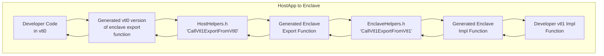
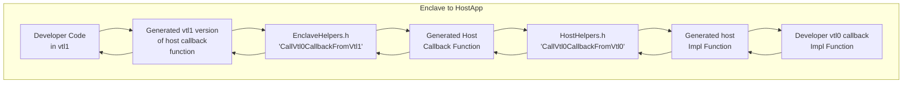
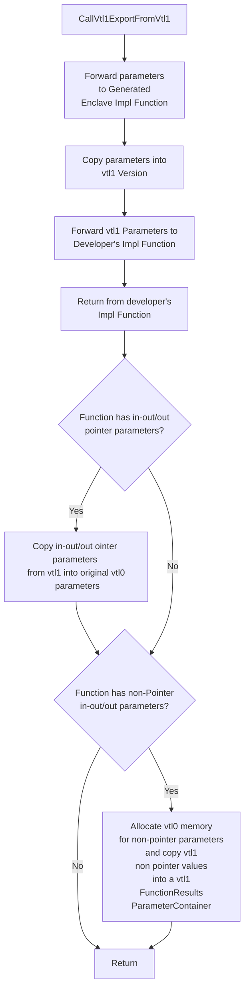
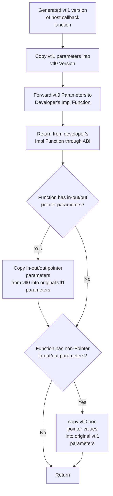

# Parameter passing between virtual trust layers

There are two scenarios our ABI covers `HostApp -> Enclave` and `Enclave -> HostApp`. Regardless of whether the caller
is a function in vtl0 with data destined for a vtl1 function or the caller is a vtl1 function with data destined for 
vtl0, the ABI layer will handle forwarding the parameters from one side to the next. The `VbsEnclaveTooling` 
executable will generate code for communication between both sides of the trust boundary, allowing us to 
forward function parameters and return values between vtl0 and vtl1.
See [CodeGeneration.md](../tests/EnclaveTests/CodeGenTestFunctions.edl), for more info on how the code generation works.

Depending on the scenario, the developer will start by calling into a generated function and passing arguments into it:


`Note:` The "Generated Enclave Export Function" is a `VTL1` function that takes a `void*` and returns a `void*` that is 
exported by the enclave. The `CallVtl1ExportFromVtl0` in the above diagram uses the `CallEnclave` Win32 api to call this
function.



`Note:` The "Generated Host Callback Function" is a `VTL0` callback function that takes a `void*` and returns a `void*` 
that the developer must register with a `RegisterVtl0Callbacks` function call. They must do this at least once, before
they can call any HostApp callbacks from the enclave. We will explain how this works in later sections.

`Note:` For both scenarios the ABI will handle returning the result and any out parameters back from the developer impl
function to the developers code that originally initiated the calls.

Continuing on with how parameter passing works, in the initial generated function the abi will package the parameters passed 
to the function into a `ParameterContainer` struct which has the following definition:

```C++
template <typename... Args>
struct ParameterContainer
{
    std::tuple<Args...> m_members;
    ParameterContainer(Args... args) : m_members(std::make_tuple(args...)) {}

    ParameterContainer() = default;
};
```

The parameters are passed to the `ParameterContainer` constructor which packages them up into its `m_member` tuple. 
`Note:` it is expected that the `m_members` member variable contain only types that conform to 
`std::is_standard_layout_v` since we copy them using raw bytes of memory between virtual trust layers.

Now that the initial generated function has packaged up the parameters into a `ParameterContainer` 
it passes them to an ABI function in `HostHelpers.h` or `EnclaveHelpers.h`. 
Depending on the scenario, two of four functions are called at some point:

|        File             |        Function           |         Scenario        |       Direction       |
| ----------------------- |:-------------------------:|:-----------------------:|:---------------------:|
| HostHelpers.h           | CallVtl1ExportFromVtl0    |    HostApp -> Enclave   | into enclave          |
| EnclaveHelpers.h        | CallVtl1ExportFromVtl1    |    HostApp -> Enclave   | to enclave functions  |
| EnclaveHelpers.h        | CallVtl0CallbackFromVtl1  |    Enclave -> HostApp   | into hostApp          |
| HostHelpers.h           | CallVtl0CallbackFromVtl0  |    Enclave -> HostApp   | to hostApp functions  |


The `CallVtl1ExportFromVtl0` and `CallVtl0CallbackFromVtl1` functions both serve the same purpose but for their 
respective virtual trust layers. Which is to package up the `ParameterContainer` into a `EnclaveFunctionContext`
object, call a generated function that takes and returns a `void*` and return the result back to its caller. 
The `EnclaveFunctionContext` is what is used as the `lpParameter` parameter to the `CallEnclave` Win32 api and 
has the following definition:

```C++
struct EnclaveFunctionContext
{
    EnclaveParameters m_forwarded_parameters {};

    EnclaveParameters m_returned_parameters {};
};
```

The `EnclaveParameters` object is defined as:

```C++
struct EnclaveParameters
{
    void* buffer {};
    size_t buffer_size {};
};
```

The `ParameterContainer` object is added to the `m_forwarded_parameters` member of the `EnclaveFunctionContext` object.
`m_forwarded_parameters.buffer` will point to the address of the `ParameterContainer` object and the size of the 
`ParameterContainer` object (`sizeof(ParameterContainer)`) will be used for the `m_forwarded_parameters.buffer_size` 
member variable.

Initially the `m_returned_parameters` buffer member will be null and its buffer_size member will be set to zero. 
The expectation is that the ABI functions in the callee side of the exchange will update these members upon returning
from the developers impl function on the opposing side of the virtual trust layer.

### CallVtl1ExportFromVtl0 and CallVtl0CallbackFromVtl1 similarities

Both `CallVtl1ExportFromVtl0` and `CallVtl0CallbackFromVtl1` take in a ParameterContainer for the parameters to forward
across the virtual trust layer and also a `FunctionResult` struct that contains a separate ParameterContainer which will
contain any non pointer out parameters and the developer function impls return value if it has one.

FunctionResult definition:
```C++
template <typename ReturnParamsT>
    struct FunctionResult
    {
        ReturnParamsT* m_returned_parameters;

        ~FunctionResult()
        {
            if (m_returned_parameters)
            {
                ::HeapFree(GetProcessHeap(), 0, m_returned_parameters);
            }
        }
    };
```

The FunctionResult is updated with a ParameterContainer object from the generated function that calls the developers impl
function. 

### Internal ABI results

We expect all generated functions that are called using `CallEnclave` to return an `HRESULT`. This is just for ABI purposes so we can propagate errors from 
one side to the next. _The developers impl functions themselves can return any of the supported edl types, which as stated above would
be returned inside a FunctionResult struct and then further processed to extract the values from within it_.

Both of the function return an HRESULT, so if ABI function across the virtual trust boundary fails e.g returns a failure HRESULT
or throws the `CallVtl1ExportFromVtl0` and `CallVtl0CallbackFromVtl1` functions would also return that HRESULT back to the caller 
(the generated function that called it). The generated function can then decide to throw an exception or return an HRESULT, based
on how it was generated.

### CallVtl1ExportFromVtl0 and CallVtl0CallbackFromVtl1 differences

CallVtl1ExportFromVtl0 Function signature:

```C++
template <typename ParamsT, typename ReturnParamsT>
static inline HRESULT CallVtl1ExportFromVtl0(
        _In_ void* enclave_instance,
        _In_ std::string_view function_name,
        _In_ ParamsT& params_container,
        _Inout_ FunctionResult<ReturnParamsT>& return_params);
```

In the case where `CallVtl1ExportFromVtl0` is used, `enclave_instance` and `function_name` (name of the generated enclave export
function) are used together to get the address of the export function. This is then passed to the `CallEnclave` api as
the `lpRoutine` parameter.

CallVtl0CallbackFromVtl1 Function signature:

```C++
template <typename ParamsT, typename ReturnParamsT>
static inline HRESULT CallVtl0CallbackFromVtl1(
    _In_ std::uint32_t function_index,
    _In_ ParamsT* params_container,
    _Inout_ FunctionResult<ReturnParamsT>& callback_result);
```

For the `CallVtl0CallbackFromVtl1` case the `index` of the vtl0 callback is what is passed to the function.

### How callbacks work

Based on the function declarations inside the `untrusted` scope of the .edl file, the code generator 
will generate a callback function that can be used in a `CallEnclave` call for each function. In addition to this,
a function called `RegisterVtl0Callbacks` for use in vtl0 and also a `__AbiRegisterVtl0Callbacks__` export
function counterpart in vtl1 are also generated. Calling `RegisterVtl0Callbacks` at least once before interacting with
the other generated callback functions will add each function pointer into a vtl1 map where the index of the function is
the key and the function pointer is the value. This happens because `RegisterVtl0Callbacks` creates a ParameterContainer
using an `std::array` of all the function pointers as input to its constructor. Ultimately a `CallVtl1ExportFromVtl0`
call is made destined for `__AbiRegisterVtl0Callbacks__` export, who will then pass the input to the `RegisterVtl0Callbacks`
ABI function in the EnclaveHelpers.h file where the function pointers are added to the map.

#### Default callbacks that are always added

Regardless of whether or not a developer adds any `untrusted` function declarations to the .edl file two callbacks will be
automatically added:


|        Callback                |        Comments           |   For Developer Use   |   Input parameter  |
| ------------------------------ |:-------------------------:|:---------------------:|:------------------:|
| AllocateVtl0MemoryCallback     | Uses HeapAlloc win32 api  |          No           |   size_t as void*  |
| DeallocateVtl0MemoryCallback   | Uses HeapFree win32 api   |          No           |           -        |

What this means is that a developer must free any out parameter or return value that contains pointers with HeapFree or
simply use the wil::unique_process_heap_ptr smart pointer. The abi layer should only provide function return values
and out values with the same vtl memory as where the function is called from. So, the developer should not need to worry about
whether the data they're freeing is vtl0 or vtl1. If the function is in vtl1 they will only have vtl1 memory returned to them and vice versa for vtl0.

### How copying between virtual trust layers works

As you can see in the table above both `CallVtl1ExportFromVtl0` and `CallVtl0CallbackFromVtl1` have sibling functions that
will be called on the other side of the trust boundary. In the HostApp -> Enclave case `CallVtl1ExportFromVtl1` is used to 
copy the vtl0 `EnclaveFunctionContext` and its `forwarded_parameters` member into vtl1. The following flowchart outlines
the general flow for the function.



To copy values into and out of the enclave we use the `EnclaveCopyIntoEnclave` and `EnclaveCopyOutOfEnclave` Win32 enclave
accessor methods, which internally does memory checks to confirm that the memory being copied and the memory to be copied
belongs to either vtl0 or vtl1 depending on which method is used. 

The Enclave -> HostApp case is a bit different. In this case the work to do the copying is done before crossing the trust boundary 
since vtl0 cannot read vtl1's memory. So, the copying is done within the generated vtl1 version of the callback that the developer
will call, which would then put these copied parameters into a ParameterContainer and pass it to `CallVtl0CallbackFromVtl1`.

Inside the generated vtl1 version of the callback, the vtl1 parameters need to be copied into vtl0 memory and then forwarded through the abi layer
to the correct developer callback function in vtl0. The flow is the following:



In this case the FunctionResult is returned from the generated host impl function and back through the ABI to the caller
(the vtl1 version of the callback). Any return values from the vtl0 FunctionResult struct are copied into
its associated vtl1 parameter, or returned directly to the vtl1 caller if it's the functions return value and not an 
in-out/out parameter. Note: If there were in-out/out pointer parameters, the memory from the original vtl0 pointers that
were forwarded to the developers vtl0 callback is copied into the vtl1 parameters before returning.
